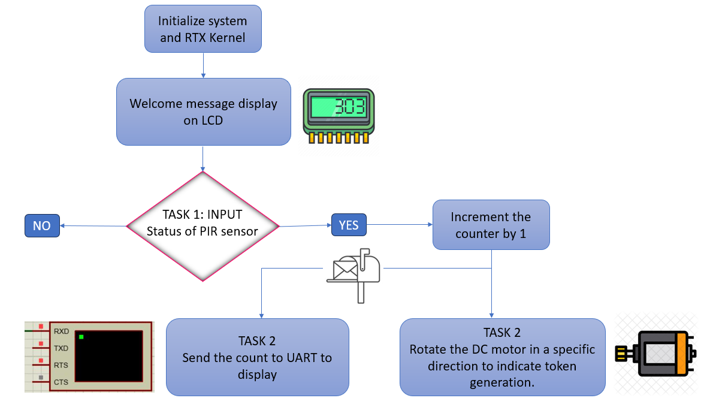

# PIR Sensor Interfacing with LPC1768 Microcontroller

Welcome to the PIR Sensor Interfacing repository! The pir_interface.zip file contains code for interfacing a PIR (Passive Infrared) sensor with a Cortex M3 based LPC1768 microcontroller.

## Overview

In this project, we utilize the LPC1768 microcontroller to implement a system that involves tasks such as PIR sensor input handling, LCD display, DC motor control, and UART communication. Tasks run concurrently and independently, requiring synchronization to ensure cohesive and conflict-free operation.

## RTX Objects and Mailbox Utilization

- Utilization of "RTX Objects" and "Mailbox" for managing tasks and communicating status data across events.
- Tasks include PIR sensor input, LCD display, DC motor control, and UART communication.
- Synchronization ensures coherent execution of tasks, avoiding discrepancies in data display.

  

https://github.com/chinmayeebl/Embedded_Microcontrollers/assets/143340347/34f35a26-2b53-4795-9715-0eff08e37655

## Getting Started

Refer to the pir_interface.zip file for the complete code and project setup.
